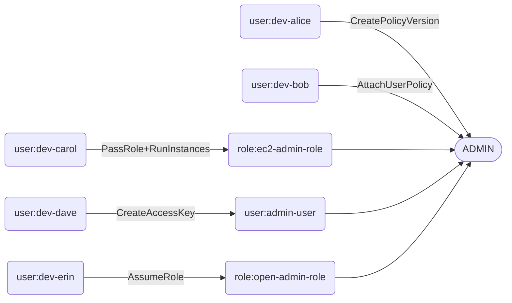

```mermaid
graph LR
  ADMIN(["ADMIN"])
  p1("user:dev-alice")
  p1 -->|CreatePolicyVersion| ADMIN
  p2("user:dev-bob")
  p2 -->|AttachUserPolicy| ADMIN
  p3("user:dev-carol")
  p4("role:ec2-admin-role")
  p3 -->|PassRole+RunInstances| p4
  p4 --> ADMIN
  p5("user:dev-dave")
  p6("user:admin-user")
  p5 -->|CreateAccessKey| p6
  p6 --> ADMIN
  p7("user:dev-erin")
  p8("role:open-admin-role")
  p7 -->|AssumeRole| p8
  p8 --> ADMIN
```
